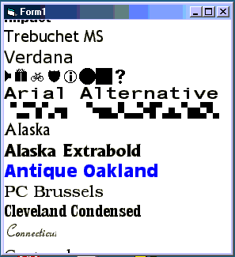

<div align="center">

## Create Font List Like Office 2000, NO BUGS unlike OTHERS VOTE NOW


</div>

### Description

To Make a font list like Microsoft Office 2000 does.....PLEASE VOTE FOR IT...it is 100% compatible and it works perfectly...

if you have any sorta comments send them over..

or any sorta critics too
 
### More Info
 
Make a label

call it Lbl(0)

it must be an array

and then just paste this code to the form

and wallaaaaah

It takes some time to load but heck its gr8


<span>             |<span>
---                |---
**Submitted On**   |
**By**             |[Mohammad Abdullah](https://github.com/Planet-Source-Code/PSCIndex/blob/master/ByAuthor/mohammad-abdullah.md)
**Level**          |Advanced
**User Rating**    |3.9 (35 globes from 9 users)
**Compatibility**  |VB 5\.0, VB 6\.0
**Category**       |[VB function enhancement](https://github.com/Planet-Source-Code/PSCIndex/blob/master/ByCategory/vb-function-enhancement__1-25.md)
**World**          |[Visual Basic](https://github.com/Planet-Source-Code/PSCIndex/blob/master/ByWorld/visual-basic.md)
**Archive File**   |[](https://github.com/Planet-Source-Code/mohammad-abdullah-create-font-list-like-office-2000-no-bugs-unlike-others-vote-now__1-27575/archive/master.zip)


### Source Code

```
Dim FocusedFont As Double
Private Sub Form_KeyDown(KeyCode As Integer, Shift As Integer)
If KeyCode = 40 Then
 FocusedFont = FocusedFont + 1
 If FocusedFont <= Screen.FontCount Then
 Lbl(FocusedFont - 1).ForeColor = &H0&
 Lbl(FocusedFont - 1).FontBold = False
 Lbl(FocusedFont - 1).BackStyle = 0
 Lbl(FocusedFont).BackStyle = 1
 Lbl(FocusedFont).FontBold = True
 Lbl(FocusedFont).ForeColor = &HFFFFFF
 Lbl(FocusedFont).BackColor = &H0&
 Else
 FocusedFont = FocusedFont - 1
 End If
 If Lbl(FocusedFont).Top > Form1.Height Then
 Dim UpMovement As Integer
 UpMovement = Lbl(FocusedFont).Height
 Dim A As Double
 A = 1
 Do Until A >= Lbl.Count
  Lbl(A).Top = Lbl(A).Top - UpMovement
  A = A + 1
 Loop
 End If
ElseIf KeyCode = 38 Then
 FocusedFont = FocusedFont - 1
 If FocusedFont >= 0 Then
 Lbl(FocusedFont + 1).ForeColor = &H0&
 Lbl(FocusedFont + 1).FontBold = False
 Lbl(FocusedFont + 1).BackStyle = 0
 Lbl(FocusedFont).BackStyle = 1
 Lbl(FocusedFont).FontBold = True
 Lbl(FocusedFont).ForeColor = &HFFFFFF
 Lbl(FocusedFont).BackColor = &H0&
 Else
 FocusedFont = FocusedFont + 1
 End If
 If Lbl(FocusedFont).Top < 0 Then
 Dim DownMovement As Integer
 DownMovement = Lbl(FocusedFont).Height
 A = 1
 Do Until A >= Lbl.Count
  Lbl(A).Top = Lbl(A).Top + DownMovement
  A = A + 1
 Loop
 End If
End If
End Sub
Private Sub Form_Load()
Dim A As Double
Lbl(A).Top = 0
Lbl(A).Left = 0
Lbl(A).Height = 0
Lbl(A).Caption = ""
Form1.BackColor = &HFFFFFF
Lbl(A).BackStyle = 0
Do Until A = Screen.FontCount
 Load Lbl(A + 1)
 With Lbl(A + 1)
 .Visible = True
 .Top = Lbl(A).Top + Lbl(A).Height
 .AutoSize = True
 .FontName = Screen.Fonts(A)
 .FontSize = 16
 .FontBold = False
 .Caption = Screen.Fonts(A)
 End With
 A = A + 1
Loop
FocusedFont = 0
End Sub
Private Sub Lbl_MouseMove(Index As Integer, Button As Integer, Shift As Integer, X As Single, Y As Single)
Dim A As Double
A = 1
FocusedFont = Index
Do Until A = Lbl.Count
 If A = Index Then
 Lbl(A).BackStyle = 1
 Lbl(A).FontBold = True
 Lbl(A).ForeColor = &HFFFFFF
 Lbl(A).BackColor = &H0&
 Else
 If Lbl(A).BackStyle = 1 Then
  Lbl(A).FontBold = False
  Lbl(A).ForeColor = &H0&
  Lbl(A).BackStyle = 0
 End If
 End If
 A = A + 1
Loop
End Sub
```

